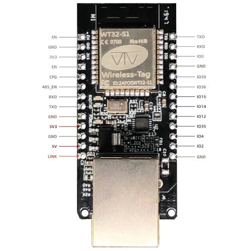
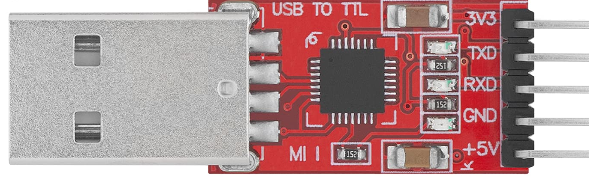

# ESP32 UDP Communication Project

This project allows you to set up **UDP communication** between an **ESP32 with Ethernet** and a **PC**. 

The ESP32 sends UDP packets at a frequency of **1 kHz** using **FreeRTOS**, and the PC receives and logs these packets.

---

## 📁 Files

- `esp32_upd_sender.ino`: Arduino sketch for the ESP32.
- `udp_receiver.py`: Python script to run on the PC to receive UDP packets.

---

## Hardware
- ESP32 WT32-ETH01



- CP2102 USB to TTL




## Software
- Ubuntu 22.04
- Arduino IDE 2.3.6
- ESP32 board in Arduino IDE: ESP32 by espressif 3.2.0
- Arduino library: WebServer_WT32_ETH01 1.5.1

When using that library, go to :  and change

```cpp
#if ESP32
  #warning Using ESP32 architecture for WebServer_WT32_ETH01
  #define BOARD_NAME      "WT32-ETH01"
#else  
```

to:
```cpp
#if defined(ESP32)
  #warning Using ESP32 architecture for WebServer_WT32_ETH01
  #define BOARD_NAME      "WT32-ETH01"
#else  
```


---

## 🛠️ Setup Instructions

### 🔌 ESP32 Setup

1. **Hardware**: 
    - To load an script to the ESP32, IO0 must be connected to GND (this can be done with a jumper).
    - To run a program, IO0 cannot be connected to GND.
    - You should create an Ethernet profile in your PC:
        - Add: 192.168.0.1
        - Netmask: 255.255.255.0
        - Gateway: 192.168.0.1
    - Ensure that the profile matches with the ESP32:
        - IP: 192.168.0.2
        - Gateway: 192.168.0.1
        - SN: 255.255.255.0

2. **Arduino IDE**:
   - Install the **ESP32 board support package**.
   - Ensure the `ETH.h` and `WiFiUdp.h` libraries are available (they come with the ESP32 core).
3. **Upload Code**:
   - Open `ESP32_UDP_Sender.ino` in the Arduino IDE.
   - Replace `udpAddress` with your **PC's IP address**.
   - Upload the code to your ESP32.

---

### 💻 PC Setup (Ubuntu 22.04)

1. **Check Your IP Address**:
   ```bash
   ip a
   ```